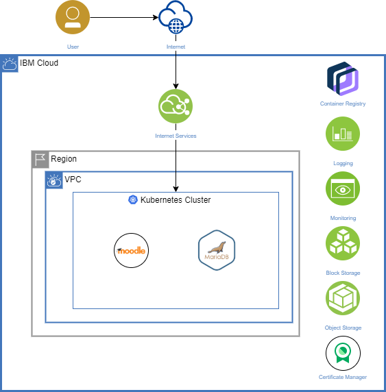

# Moodle Single-Zone Region Deployment on Kubernetes Cluster in IBM Cloud

Moodle is a Learning Platform or course management system (CMS) - a free Open Source software package designed to help educators create effective online courses based on sound pedagogical principles. Moodle has a large and diverse user community with over 100,000 sites registered worldwide speaking over 140 languages in every country. It is designed to provide educators, administrators and learners with a single robust, secure and integrated system to create personalized learning environments.
This repos provides a step by step guide to show how to build a complete solution for Moodle on a single-zone Kubernetes Cluster on VPC in IBM Cloud. The solution includes data storage, backups, DNS setup, security, logging and monitoring.

## Solution Details
The solution is composed of two main containers: Moodle container that represents Moodle application with a persistence storage attached to store Moodle data and the second container represents MariaDB database with a persistence volume attached to store the database data.

Those two containers are deployed along with all the other required resources in Kubernetes such as persistence volumes, secrets, config maps, etc. by using [Moodle Bitnami Helm Chart](https://github.com/bitnami/charts/tree/master/bitnami/moodle). 

The Kubernetes Cluster is provisioned with its worker nodes in Virtual Private Cloud (VPC) that has one subnet configured in one zone with public gateway. 

Database Backups is configured manually after Moodle deployment by using Kubernetes Cronjob and Object Storage as a persistence volume (Object Storage Storageclasses might need to be configured on the Kubernetes Cluster if it is not already configured).

Cloud Internet Services are used to configure the DNS and then to add some security features such as Distributed Denial of Service (DDoS) protection, and Web Application Firewall (WAF).

The solution also includes logging and monitoring services by using IBM Log Analysis with LogDNA and IBM Cloud Monitoring with Sysdig respectively.

## Components

| Component | Configuration | Notes |
| - | - | - |
| **Virtual Private Cloud (VPC)** | Configured with one subnet with public gateway. | VPC is required to host the Kubernetes Cluster and its worker nodes.|
| **Kubernetes Cluster** | Provisioned with 3 worker nodes each 2 vCPU and 4 GB. |  <ul><li>As per Moodle documentation, the minimum compute power is 1GB memory for development environment and 8 GB for production ones. Reference: https://docs.moodle.org/310/en/Installing_Moodle </li> <li>The minimum number of worker nodes per cluster is 2. </li><li>If is expected heavily usage, you can consider increasing the computing power accordingly or you can even consider provisioning a multi-zone cluster.</li></ul>|
| **Moodle – Bitnami Helm Chart** | Configured to easily deploy both Moodle and Maria DB containers. | Moodle Helm Chart makes the deployment of Moodle much easier as it includes both Moodle and MariaDB containers along with all the required resources such as config maps, secrets and persistence volume. For the persistence volumes, it is also responsible of the provisioning of the physical storage. |
| **Block Storage for VPC** | Two instances are provisioned with 10GB for both Moodle data and database storage using Moodle Helm Chart. | The Helm Chart is responsible of provisioning 2 persistence volume of 10 IOPS block storage with the defined storage. The storage could be configured based on the requirements for example the number of users and data. |
| **Object Storage** | Configured with 80GB to store backups while provisioning the persistence volume for backups. | Object Storage is used for storing database backups. Full database backup is taken by cronjob, you can configure this job to control the frequency of the backups and the retention period for the backups and also you can identify the size of the storage that is required for backups. |
| **Cloud Internet Services** | Standard Plan | It is used to configure DNS. It also contains Web Application Firewall and DDoS attacks protection. |
| **Certificate Manager** | Free Plan | It is used to manage the SSL certificates. |
| **IBM Log Analysis with LogDNA** | 7 days log search – 100GB | It is used for logging. You use other packages with extra storage based on your requirements. |
| **IBM Cloud Monitoring with Sysdig** | Graduated Tier – 3 nodes and 2 containers | It is used for monitoring your cluster. |
---

## Architecture



## Implementation

This section shows step by step how to implement the full solution starting by creating the Virtual Private Cloud, provisioning the Kubernetes Cluster, then deploying Moodle and MariaDB using Moodle Bitnami Helm Chart, configuring the Database Backups jobs, configuring the DNS and securing your application and finally enabling the logging and monitoring services for the Kubernetes Cluster.

### Prerequisite
-	IBM Cloud Account.
-	Command Line Interface (Preferably Linux Based).
-	Domain name.

### Steps
[1. Setup Command Line Tools](#1-setup-command-line-tools)

[2. Create Your Virtual Private Cloud (VPC)](#2-create-your-virtual-private-cloud-vpc)

[3. Provision Kubernetes Cluster](#3-provision-kubernetes-cluster)

[4. Deploy Bitnami Moodle Helm Chart](#4-deploy-bitnami-moodle-helm-chart)

[5. Configure Object Storage StorageClasses in the Kubernetes Cluster](#5-configure-object-storage-storageclasses-in-the-kubernetes-cluster)

[6. Configure the database backups](#6-configure-the-database-backups)

[7. Configure the Cloud Internet Services](#7-configure-the-cloud-internet-services)

[8. Enable Logging and Monitoring Services](#8-enable-logging-and-monitoring-services)

[9. (Optional) Install a new Moodle theme](#9-optional-install-a-new-moodle-theme)

### 1. Setup Command Line Tools
1. Install IBM Cloud CLI `ibmcloud` along with IBM Cloud Kubernetes Service plug-in `ibmcloud ks`, IBM Cloud Container Registry plug-in `ibmcloud cr` and IBM Cloud Kubernetes Service observability plug-in `ibmcloud ob` by following the steps [here](https://cloud.ibm.com/docs/containers?topic=containers-cs_cli_install#cs_cli_install_steps).
2. Download the Kubernetes CLI major.minor version that matches the Kubernetes cluster major.minor version that you plan to use. The current IBM Cloud Kubernetes Service default Kubernetes version is 1.18.14.

    **OS X:** https://storage.googleapis.com/kubernetes-release/release/v1.18.14/bin/darwin/amd64/kubectl
    
    **Linux:** https://storage.googleapis.com/kubernetes-release/release/v1.18.14/bin/linux/amd64/kubectl

    **Windows:** Install the Kubernetes CLI in the same directory as the IBM Cloud CLI. This setup saves you some file path changes when you run commands later. https://storage.googleapis.com/kubernetes-release/release/v1.18.14/bin/windows/amd64/kubectl.exe

3. After the installation of Kubernetes CLI `kubectl` on your local machine, make sure to add it to your `PATH` system variable.
4. Verify the installation of kubectl by running the following command:
`kubectl version`
5. Install the latest release of the version 3 Helm CLI on your local machine.
6. Verify the installation of helm by running the following command:
`helm version`

### 2. Create Your Virtual Private Cloud (VPC)
1. Login to IBM Cloud with your credentials from the following link: https://cloud.ibm.com/.
2. From the left side menu, select **VPC Infrastructure** then select **VPCs** under **Network**.
   
   **Note:** You can also reach the VPC page directly from this link: https://cloud.ibm.com/vpc-ext/network/vpcs
3. Select the region where you want to provision your cluster from the region list then click **Create +**.
4. Fill the **New Virtual Private Cloud** form by entering the **Name** for example moodle-demo-vpc and then keep the rest of the values with default value.
5. Scroll down to **New subnet for VPC** form then enter a **Name** for the new subnet for example subnet-01, select the **Location** where you are going to provision the Kubernetes Cluster and enable the Public gateway at the bottom of the form.
6. Click **Create virtual private cloud** from the right side.

### 3. Provision Kubernetes Cluster
1. From the left side menu, select **Kubernetes** and then click on **Clusters**.
2. Click **Create cluster +**.
3. Fill the **Kubernetes cluster** form with the following:
    - Select **Standard** in **Pricing Plan**.
    - Select **Kubernetes** default version, currently it is **1.18.14**.
    - Under **Infrastructure**, select **VPC**.
    - Select the **virtual private cloud** that was created in the previous step.
    - Keep the **Default** **Resource group**.
    - In the **Worker zones**, check only the zone that has subnet and uncheck the other two zones.
    - Under Worker pool, click **Change flavor** and select the node with 2 vCPU and 4GB Memory **cx2.2x4** then click **Save worker pool flavor**.
    - Keep the number of **Worker nodes per zone** as **3**.
    - Keep the **Worker pool name** with the **default** value and select **Both private & public endpoints** under **Master service endpoint**.
    - Enter a name for your cluster and then add tags for your Cluster if you want.
4. After filling the form, Click **Create** button in the right side. 
5. Wait until the cluster is provisioned successfully, that will take some time up to 20 minutes.
6. If your cluster runs Kubernetes version 1.18 or earlier, will need to apply the following steps:
   - From the left side menu, select **VPC Infrastructure** then select **Security groups** under **Network**.
    
        **Note:** You can also reach the VPC page directly from this link: https://cloud.ibm.com/vpc-ext/network/securityGroups
   - Select the region where your cluster is provisioned. 
   - Select the security group that belongs to your VPC, you can identify it from the Virtual Private Cloud column.
   - Select Rules from the top menu.
   - Under **Inbound rules**, click **Create +**.
   - Select **TCP** in **Protocol**, **Port range** in **Port**, *30000* in **Port min**, *32767* in **Port max** and **Any** in **Source type** then click **Save**.
   - Repeat the same step again to add the same rule for the **UDP** protocol.
7. To Confirm that the setup of the Kubernetes Cluster is done successfully, make sure that the cluster status is **Normal** with the green mark and that the ingress status is **Healthy** with the green mark.

### 4. Deploy Bitnami Moodle Helm Chart
1. From the command line, login to IBM Cloud by running the following command:
`ibmcloud login –sso`. Follow the steps to login in the browser then enter the passcode in the command line to login.
2. Make sure to select the region where you provisioned your cluster by running the following command: `ibmcloud target -r <region>`
 
    **Note:** To get the name of your region you can list all the regions available in IBM Cloud by using the following command: `ibmcloud regions`
3. Make sure to select the resource group where you provisioned your cluster by running the following command: `ibmcloud target -g <region>`
 
    **Note:** the default resource group is **Default** unless you change it during the provisioning.
4. List your clusters by running the following command: `ibmcloud ks clusters`
5. Set the cluster that you created as the context for this session by running the following command: `ibmcloud ks cluster config -c <cluster_name_or_ID>`
6. Verify that kubectl commands run properly and that the Kubernetes context is set to your cluster by running the following command: `kubectl config current-context`
7. Create a new namespace for Moodle deployment by running the following command: `kubectl create namespace moodle`
8. Add bitnami-ibm repos to your helm repos by running the following command: `helm repo add bitnami-ibm https://charts.bitnami.com/ibm`
9. Download [values.yaml](./values.yaml) file in your local machine, in the solution here will keep all the default values except the size of the persistence volumes will make it 10Gi, so will update in line 216 and 341.
    
    **Note:** Feel free to update other values in the file, you can check the full documentation from this link: https://github.com/bitnami/charts/tree/master/bitnami/moodle
10. Start the deployment of Moodle by running the following command: `helm install moodle bitnami/moodle -f values.yaml --namespace moodle`
    
    **Note:** set the correct path for values.yaml file in your local machine.
11. Moodle deployment will take some time, to verify that the deployment is done successfully, apply the following steps:

    - Verify that all the pods are in Running status by running the following command: `kubectl get pods --namespace moodle -w`
 
        **Note:** Wait until the status of all the pods turn into Running status and both containers have 1/1 Ready. (To exit this command, use Ctrl+C)
    - Verify that the load balance is exposed successfully by running the following command: `kubectl get events --namespace moodle -w --field-selector involvedObject.kind=Service,involvedObject.name=moodle`
 
        **Note:** Wait until you are able to see a message similar to the following message (To exit this command, use Ctrl+C):
        > Event on cloud load balancer moodle for service moodle/moodle with UID 1da290dd-636a-45d6-b8c6-528dde484013: The VPC load balancer that routes requests to this Kubernetes LoadBalancer service is currently online/active
    - Obtain the URL of the deployed application then check in your browser. You can get the URL by running the following command: `kubectl get svc --namespace moodle moodle --template "{{ range (index .status.loadBalancer.ingress 0) }}{{.}}{{ end }}"`
 
        **Important Notes**
        - In the browser you can verify the deployment.
        - The default Moodle admin username is user unless it was modified in values.yaml file and the password can be retrieved from the secrets by running the following commands: `kubectl get secret --namespace moodle moodle -o jsonpath="{.data.moodle-password}" | base64 –decode`.
        - The password is randomly generated unless it was modified in values.yaml file.


### 5. Configure Object Storage StorageClasses in the Kubernetes Cluster
1. Create IBM Cloud Object Storage instance by applying the following steps:
   - Back to the browser, open the IBM Cloud Object Storage catalog page from the following link: https://cloud.ibm.com/catalog/services/cloud-object-storage
   - Enter a **Service name** for your instance, such as *cos-backup*, select the **Standard** plan and select the same resource group as your cluster, the default is Default.
   - Click **Create** button in the right side.
2. Create IBM Cloud Object Storage service credentials by applying the following steps:

   - After the creation of the Object Storage instance successfully, select **Service credentials** from the left menu.
   - Click **New credential +** button. A dialog box opens.
   - Keep the default values with the **Writer** Role and then click **Add**.
   - Click on the newly created service credentials.
   - Make note of the **apikey** to use OAuth2 tokens to authenticate with the IBM Cloud Object Storage service.
3. Create a secret for the object storage service credentials by applying the following steps:
   - Get the GUID of your IBM Cloud Object Storage service instance by running the following command: `ibmcloud resource service-instance <object-storage-name>`
 
        Important Notes
        - `<object-storage-name>` is the name of the object storage that was created in step 1 in this example was cos-backup.
        - Make note of the GUID value.
   - Create a Kubernetes secret to store your service credentials. When you create your secret, all values are automatically encoded to base64. In the following example the secret name is **cos-write-access**. Run the following command: `kubectl create secret generic cos-write-access --type=ibm/ibmc-s3fs --from-literal=api-key=<api_key> --from-literal=service-instance-id=<service_instance_guid>`
 
        **Note:** api_key and service_instance_guid are the values that you took notes for in the previous steps.
   - Verify that the secret is created in your namespace by running the following command: `kubectl get secret --namespace moodle`
4. Install the IBM Cloud Object Storage plug-in by applying the following steps:
   - Add the IBM Cloud Helm repo to your cluster by running the following command: `helm repo add ibm-helm https://raw.githubusercontent.com/IBM/charts/master/repo/ibm-helm`
   - Download the Helm charts and unpack the charts in your current directory by running the following command: `helm fetch --untar ibm-helm/ibm-object-storage-plugin`
   - Install the Helm plug-in by running the following command: `helm plugin install ./ibm-object-storage-plugin/helm-ibmc --namespace moodle`
   - Install the ibm-object-storage-plugin in your cluster. When you install the plug-in, pre-defined storage classes are added to your cluster.

        If you are using OS X or Linux, run the following command: `helm ibmc install ibm-object-storage-plugin ibm-helm/ibm-object-storage-plugin --set license=true`

        If you are using Windows, run the following command: `helm install ibm-object-storage-plugin ./ibm-object-storage-plugin --set dcname="${DC_NAME}" --set provider="${CLUSTER_PROVIDER}" --set workerOS="${WORKER_OS}" --set platform="${PLATFORM}" --set license=true`
        
        **Important Notes**
     - DC_NAME: The datacenter where your cluster is deployed. To retrieve the datacenter, run `kubectl get cm cluster-info -n kube-system -o jsonpath="{.data.cluster-config.json}{'\n'}"`. Store the datacenter value in an environment variable by running `SET DC_NAME=`. Optional Set the environment variable in Windows PowerShell by running `$env:DC_NAME=""`.
     - CLUSTER_PROVIDER: The infrastructure provider. To retrieve this value, run `kubectl get nodes -o jsonpath="{.items[].metadata.labels.ibm-cloud.kubernetes.io\/iaas-provider}{'\n'}"`. If the output from the previous step contains `softlayer`, then set the CLUSTER_PROVIDER to "IBMC". If the output contains `gc`, `ng`, or `g2`, then set the CLUSTER_PROVIDER to "IBM-VPC". Store the infrastructure provider in an environment variable. For example: `SET CLUSTER_PROVIDER="IBM-VPC"`.
     - WORKER_OS and PLATFORM: The operating system of the worker nodes. To retrieve these values, run `kubectl get nodes -o jsonpath="{.items[].metadata.labels.ibm-cloud.kubernetes.io\/os}{'\n'}"`. Store the operating system of the worker nodes in an environment variable. For IBM Cloud Kubernetes Service clusters, run `SET WORKER_OS="debian"` and `SET PLATFORM="k8s"`.
   - Verify that the plug-in is installed correctly by running the following command: `kubectl get pod --namespace kube-system -o wide`
 
        **Note:** In the output you should be able to see object storage pods.
   - Verify that the storage classes are created successfully by running the following command: `kubectl get storageclass`
 
        **Note:** In the output you should be able to see object storage classes.

### 6. Configure the database backups
1. In order to store the backups for the database, an Object Storage persistence volume claim needs to be provisioned with the required storage size by applying the following steps:
   - Download [mariadb-backup-pvc.yaml](./mariadb-backup-pvc.yaml) file in your local machine. In this exercise, the default values will provision 80GB storage using the vault regional storage class.

        **Important Notes**
        - Review mariadb-backup-pvc.yaml file and make sure that namespace, secret-name (secret-name is the name of the secret that was created previously in step 5.3) are the same ones you use in your cluster.
        - Make sure to check the storage size, storage class name and endpoint and update their values if you would like to change the selected values.
        - To check the available endpoints in your instances, open your Object Storage under **Storage** in this link: https://cloud.ibm.com/resources then select **Endpoints** from the left navigation menu.
   - After reviewing mariadb-backup-pvc.yaml file, run the following command to provision in your cluster: `kubectl apply -f filepath/mariadb-backup-pvc.yaml`
 
        **Note:** Provide the file path for mariadb-backup-pvc.yaml file in your local machine.
   - Verify that your PVC is created and bound to the PV successfully by running the following command: `kubectl get pvc -n moodle`
 
        **Note:** Make sure that the output has *mariadb-backup* pvc with the status **Bound**.
2. After the setup of the PVC, a Kubernetes CronJob will be initiated in order to automate the process of retrieving regular database backups by applying the following steps:
   - Download [mariadb-backup-cronjob.yaml](./mariadb-backup-cronjob.yaml) file in your local machine, in this solution, this cronjob will run in daily basis at midnight (Cluster region time).
        
        **Important Notes**
        - Feel free to update the schedule value at line 7 to set the schedule that suits your requirement and you can validate the format of your schedule from [here](https://crontab.guru/).
        - Make sure that the namespace is the same one that you use for your Moodle application.
        - For the environment variables, you will find:
          - MOODLE_DATABASE_HOST: should match MariaDB service name in this exercise, it is `moodle-mariadb`.
          - MARIADB_USER: should match MariaDB user that was set while running Moodle helm chart, the default is `bn_moodle`. In case it was changed previously, make sure to update in the file as well.
          - MARIADB_PASSWORD: this will be retrieved directly from the secrets that is used for MariaDB from `mariadb-password` key. This secret was automatically created by the helm chart. 
        - This cronjob will take a full backup of the database, feel free to update the backup command at line 33 in case you want a partial backup.
   - After reviewing mariadb-backup-cronjob.yaml file, run the following command to initiate the cronjob: `kubectl apply -f filepath/mariadb-backup-cronjob.yaml`
 
        **Note:** Provide the file path for mariadb-backup-cronjob.yaml file in your local machine.
   - Verify that your cronjob is created successfully by running the following command: `kubectl get cronjobs -n moodle -w`
 
        **Important Notes**
        - Make sure that the output has mariadb-backup-cronjob and wait until its SUSPEND value becomes **False**. (use Ctrl+C to exit this command).
        - You can check the backup file after midnight in the newly created bucket in the Object Storage. You can access it by selecting your Object Storage under **Storage** section in this link: https://cloud.ibm.com/resources then select **Buckets** from the left navigation menu and then click on the newly created bucket to check its content.
3. (Optional) Another Kubernetes CronJob could be initiated in order to delete the old backup files to maintain the storage size. In this solution, the cleanup job will delete the files older than 7 days, you can initiate this cronjob by running the following steps:
   - Download [mariadb-backup-cleanup-cronjob.yaml](./mariadb-backup-cleanup-cronjob.yaml) file in your local machine. In this exercise, the cronjob will run in daily basis at midnight (Cluster region time).

        **Important Notes**
       - Feel free to update the schedule value at line 7 to set the schedule that suits your requirement and you can validate the format of your schedule from here.
       - Make sure that the namespace is the same one that you use for your Moodle application.
       - Feel free to update the cleanup task at line 23 by increasing or decreasing the number of days, in this example it is set to 7 days.
   - After reviewing mariadb-backup-cleanup-cronjob.yaml file, run the following command to initiate the cronjob: `kubectl apply -f filepath/mariadb-backup-cleanup-cronjob.yaml`
 
        **Note:** Provide the file path for mariadb-backup-cleanup-cronjob.yaml file in your local machine.
   - Verify that your cronjob is created successfully by running the following command: `kubectl get cronjobs -n moodle -w`
 
        **Important Notes**
        - Make sure that the output has mariadb-backup-cleanup-cronjob and wait until its SUSPEND value becomes **False**. (use Ctrl+C to exit this command).
        - You can check the number of the backup files after 7 days and verify that the files older than 7 days get deleted successfully in the newly created bucket in the Object Storage. You can access it by selecting your Object Storage under **Storage** section in this link: https://cloud.ibm.com/resources then select **Buckets** from the left navigation menu and then click on the newly created bucket to check its content.

### 7. Configure the Cloud Internet Services
1. Provision the Cloud Internet Services by applying the following steps:
   - Open IBM Cloud Catalog from this link: https://cloud.ibm.com/catalog
   - Type **Internet Services** in the search bar.
   - Open the Internet Services, select **Standard** plan, enter **Service Name** for example *Moodle-Internet-Services* and make sure to select the same resource group for your cluster (the default resource group is **Default**).
   - Click **Create** button in the right side.
2. Activate your domain in the Cloud Internet Services by applying the following steps:
   - Once the Internet Services is provisioned successfully, you will be redirected to the **Overview** page of the Internet Services. Click **Add domain** button.
   - Enter your domain name in the input field and then click **Next**. 
        
        **Note**: Wait until the connection the next step is loaded, it might take some time. 
   - (Optional) Setup your DNS records then click **Next**. 
   - Configure NS records in your DNS provider, then Click **Next**.
        
        **Important Notes**
        - After this step you can click **Cancel**.
        - DNS might take up to 24 hours to be successfully activated, but once it is active the Domain status will change from **Pending** to **Active**.
        - In case you would like to check the namespaces, you can check it from accessing **Reliability** page from the left navigation menu then select **DNS** tab from the top list, then you will find the name servers under **CIS name servers** section.
3. Configure your DNS by applying the following steps:
   - In the IBM Cloud Internet Services dashboard, use the left navigation menu to select **Reliability** > **Global Load Balancers**.
   - Select **Health checks** tab, then click **Create +**. 
   - Fill the form with the following values then click **Create** button:
       - Name: moodle-service
       - Monitor type: HTTP
       - Port: 80
       - Path: /
    - Select **Origin pools** tab, and then click **Create +**.
    - Fill the form with the following values then click **Save** button:
       - Name: `main-poll`
       - Origin name: `moodle-<region>-cluster`
            
            **Note:** It is better to include an identification of the cluster region in the origin pool, so in case you expand the origin pool with more regions in the future you can easily identify it. So here you will need to replace `<region>` by the region of your cluster. You can get the region by running the following command and get the location of your cluster: `ibmcloud ks cluster ls`
        - Origin address: `<IngressSubdomain>`

            **Imortant Notes** 
            - `<IngressSubdomain>` could be retrieved by running the following command and then get `Ingress Subdomain` value: `ibmcloud ks cluster get -c <cluster_name_or_ID>`
            - In case you are not going to configure SSL connection, in that case you can get the ingress subdomain directly from the service by running the following command (make sure to put the correct namespace and service name): `kubectl get svc moodle -n moodle  -o jsonpath="{.status.loadBalancer.ingress[0].hostname}"`
        - Health check region: Select the more relevant region to the users of your application.
        - Health check: Select the health check that was created in the previous step.
 
    - Create the global load balancer with the origin pools defined in the last step. Start by selecting **Load balancers** tab and, then click **Create +**.
    - Fill the form with the following values then click **Create** button:
       - Name (optional): just add a name if you would like to have a prefix for your domain otherwise keep it empty.
       - Under **Geo routes**, click Add **route**. Keep **Region** with **Default** value and under **Origin Pools** select the pool that you created in the last step then click **Add**.
 
    - Verify that DNS is configured successfully by checking your configured domain from the browser.

      **Important Notes**
      - In case you followed the path to configure SSL connection so in that case you will receive **404: Host not found** page until you configure the SSL in your Kubernetes Cluster (It will be configured in step 7.6).
      - If you are not going to configure the SSL connection so in this step you will be redirected normally to your moodle application.
      - If you choose the SSL path so make sure not to skip step 7.6.

4. Configure the Web Application Firewall by applying the following steps:
   - In the IBM Cloud Internet Services dashboard, use the left navigation menu to select **Security** then select **WAF** tab from the top bar.
   - Enable **Web Application Firewall** by turning on the switch.
   - Select **OWASP rule set** tab. In this page, you can review OWASP Core Rule Set and individually enable or disable rules. When a rule is enabled, if an incomimg request triggers the rule, the global threat score will be increased. The Sensitivity setting will decide whether an Action is triggered for the request.
      - Leave default OWASP rule sets as it is.
      - Set **Sensitivity** to **Low**.
      - Set **Action** to **Simulate** to log all the events.
   - Click **CIS rule set**. This page shows additional rules based on common technology stacks for hosting websites.
5. Configure the Denial of Service attacks protection by applying the following steps:
   - In IBM Cloud Internet Services dashboard, use the left navigation menu to select **Reliability** then select **Global load balancers** tab from the top bar.
   - Locate the GLB you created in the **Load balancers** table.
   - Enable the Security and Performance features in the **Proxy** column.
   - Verify that the DDoS protection is activated successfully by selecting **Overview** from the left side navigation menu and make sure that the **DDoS protection** status under **Security** section is **Active**.
  
        **Note:** Your GLB is now protected. An immediate benefit is that the origin IP addresses of your clusters will be hidden from the clients. If CIS detects a threat for an upcoming request, the user may see a screen like this one before being redirected to your application.

6. (Optional) Configure secured connection with HTTPS by applying the following steps (make sure that you followed the SSL path while setting the origin address in step 7.3):
   - In IBM Cloud Internet Services dashboard, use the left navigation menu to select **Security** then select **Advanced** tab from the top bar.
   - Scroll down and enable **Always use HTTPS** by clicking on the switch.
   - Open IBM Cloud Catalog from this link: https://cloud.ibm.com/catalog
   - Type **Certificate Manager** in the search bar.
   - Open the Certificate Manager, enter **Service Name** for example *Moodle-Certificate-Manager*, make sure to select the same region and resource group for your cluster (the default resource group is **Default**) and select **Public and private** in **Endpoints**.
   - Click **Create** button on the right side.
   - After the successful provisioning of Certificate Manager service, open another browser tab and navigate to Access(IAM) page from this link: https://cloud.ibm.com/iam/overview
   - Open **Authorizations** from the left navigation menu.
   - Click **Create +** button then fill the form as follows:
     - Source service: Certificate Manager
     - Select **Services based on attributes**
     - Check **Source service instance**, then select the newly created service
     - Target service: Internet Services
     - Select **Services based on attributes**
     - Check **Service instance**, then select your internet service instance
     - Under **Service access**, mark **Reader** access 
   - After filling the form, click **Authorize**.
   - To control specific domains, assign the Manager role by using the API so that Certificate Manager can manage the DNS records for the individual domains that exist in your CIS instance. You might want to copy the command to a text file to make it easy to edit the required parameters.
        ```curl -X POST https://iam.cloud.ibm.com/acms/v1/policies \
        -H 'Accept: application/json' \
        -H 'Content-Type: application/json' \
        -H 'Authorization: Bearer <token>' \
        -d '{ "type": "authorization", "subjects": [ { "attributes": [ { "name": "serviceName", "value": "cloudcerts" }, { "name": "accountId", "value": "<accountID>" }, { "name": "serviceInstance", "value": "<Certificate-Manager-GUID-based-instanceID>" } ] } ], "roles": [ { "role_id": "crn:v1:bluemix:public:iam::::serviceRole:Manager" } ], "resources": [ { "attributes": [ { "name": "serviceName", "value": "internet-svcs" }, { "name": "accountId", "value": "<accountID>" }, { "name": "serviceInstance", "value": "<Cloud-Internet-Services-GUID-based-instanceID>" }, { "name": "domainId", "value": "<domainID>" }, { "name": "cfgType", "value": "reliability" }, { "name": "subScope", "value": "dnsRecord" } ] } ] }'
        ```
        **Important Notes**
     - `<token>`: A valid IAM token. You can find the value by using the IBM Cloud CLI: `ibmcloud iam oauth-tokens`
     - `<accountID>`: The ID for the account where the Certificate Manager and CIS instances exist. You can find the value by navigating to **IBM Cloud** > **Manage** > **Account** > **Account Settings** or by using IBM Cloud CLI: `ibmcloud account show`
     - `<Certificate-Manager-GUID-based-instanceID>`: The GUID-based ID for your instance of Certificate Manager. To find the value, use the IBM Cloud CLI: `ibmcloud resource service-instance "Instance name"`
     - `<Cloud-Internet-Services-GUID-based-instanceID>`: The GUID-based ID for your instance of CIS. To find the value, use the IBM Cloud CLI: `ibmcloud resource service-instance "Instance name"`
     - `<domainID>`: The ID of your domain as it is found in CIS. To find the value, use the IBM Cloud CLI to run: `ibmcloud cis domains -i "CIS instance name"`
    
        **Note:** You might need to install ibmcloud cis plugin before using the previous command, and you install it by running this command: `ibmcloud plugin install cis`
   - Verify that the new policy with Manager role is created by refreshing the **Manage Authorization** page and checking the list of authorizations.  
   - Close the **Manage authorizations** page and return to the newly created Certificate Manager browser tab.
   - From **Your certificates**, click **Order** button to order a new certificate. 
   - Click **Continue** button, under **IBM Cloud Internet Services (CIS)** section.
   - In Certificate details tab:
     - Enter **Name** for example *moodle-ssl-certificate*
     - Optionally enter a description
     - Keep the default values for the rest of the fields
   - Move to **Domains** tab:
     - Select your Internet Services (CIS) instances
     - Check **Add Domain** box or **Add Wildcard** in case you are using a subdomain
   - In the right side, review all the values then click **Order** button. 
   - Your order is placed in a **Pending** state. It will take some time for the domain validation and for the Certificate Manager to verify that you own the requested domain, once the validations pass successfully the certificate will be issued and its state will change to **Valid**.
   - Click on the newly created certificate and take a note of **Certificate CRN** value.
   - Open the command line tools and create ingress secret using the CRN by running the following command: `ibmcloud ks ingress secret create --cluster <cluster_name_or_ID> --cert-crn <CRN> --name <secret_name> --namespace <namespace>`
 
      **Notes**
     - `<cluster_name_or_ID>`: Use your cluster name or ID.
     - `<CRN>`: It is the value that was obtained in the last step from the certificate manager.
     - `<secret_name>`: Insert any value for example: *moodle-tls-secret*.
     - `<namespace>`: Insert the same namespace used for your moodle application for example *moodle* in this exercise.
     - **Important Note**: If you need to update your certificate later, any changes that you make to a certificate in the Certificate Manager instance that was created for your cluster are automatically reflected in the secret in your cluster. However, any changes that you make to a certificate in a different Certificate Manager instance are not automatically reflected, and you must update the secret in your cluster to pick up the certificate changes.
    
         `ibmcloud ks ingress secret update --name <secret_name> --cluster <cluster_name_or_ID> --namespace <namespace> [--cert-crn <certificate_crn>]`
     - Verify that the secret is created successfully by running the following command: `kubectl get secrets <secret_name> -n moodle`
     - Download [moodle-domain-ingress.yaml](./moodle-domain-ingress.yaml) file in your local machine. Add your domains under hosts section.

         **Note:** Review moodle-domain-ingress.yaml file and make sure that namespace, secret-name (secret-name is the name of the secret that was created in the previous step) are the same ones you use in your cluster.

     - After reviewing moodle-domain-ingress.yaml file, run the following command to provision in your cluster: `kubectl apply -f filepath/moodle-domain-ingress.yaml`
 
         **Note:** Provide the file path for moodle-domain-ingress.yaml file in your local machine.

    - Verify that your ingress is created successfully by running the following command: `kubectl get ingress -n moodle`
 
   - Now the SSL should be configured successfully for your domain and you can test the accessibility for your application from the browser `https://<your-domain>`.

### 8. Enable Logging and Monitoring Services
1. Configure the logging for your cluster by applying the following steps:
   - Open IBM Cloud Catalog from this link: https://cloud.ibm.com/catalog
   - Type **IBM Log Analysis with LogDNA** in the search bar.
   - Fill the form as follows:
     - Select the same region as your cluster region
     - Select the **7 day Log Search** plan
     - Enter **Service Name**, for example *Moodle-Logging*
     - Select the same resource group as your cluster resource group (the default resource group is **Default**)
   - Click **Create** button on the right side.
   - Go to the Cluster page from this link: https://cloud.ibm.com/kubernetes/clusters and select your Cluster.
   - In the cluster **Overview** page, click **Connect** button beside the **Logging** label.
   - Select the region where you provisioned the Logging service and select the Logging service instance then click **Connect** button.
 
        **Note:** When you create the logging configuration, a Kubernetes namespace `ibm-observe` is created and a LogDNA agent is deployed as a daemon set to all worker nodes in your cluster. This agent collects logs with the extension *.log and extensionless files that are stored in the /var/log directory of your pod from all namespaces, including kube-system. The agent then forwards the logs to the IBM Log Analysis with LogDNA service.
   - Verify that the integration is done successfully, and that the daemon set for the LogDNA agent was created and all instances are listed as `AVAILABLE` by running the following command: `kubectl get daemonsets -n ibm-observe`
   - You can review the pod logs that the LogDNA agent collected from your cluster by accessing the logDNA instance by clicking **Launch** button in the **Overview** page.
2. Configure the monitoring for your cluster by applying the following steps:
   - Open IBM Cloud Catalog from this link: https://cloud.ibm.com/catalog
   - Type **IBM Cloud Monitoring with Sysdig** in the search bar.
   - Fill the form as follows:
     - Select the same region as your cluster region
     - Select the **Graduated Tier**
     - Enter **Service Name**, for example *Moodle-Monitoring*
     - Select the same resource group as your cluster resource group (the default resource group is **Default**)
   - Click **Create** button on the right side.
   - Go to the Cluster page from this link: https://cloud.ibm.com/kubernetes/clusters and select your Cluster.
   - In the cluster **Overview** page, click **Connect** button beside the **Monitoring** label.
   - Select the region where you provisioned the Monitoring service and select the Monitoring service instance then click **Connect** button.
    
        **Note:** When you create the monitoring configuration, a Kubernetes namespace `ibm-observe` is created and a Sysdig agent is deployed as a Kubernetes daemon set to all worker nodes in your cluster. This agent collects cluster and pod metrics, such as the worker node CPU and memory usage, or the amount incoming and outgoing network traffic to your pods.
   - Verify that the integration is done successfully, and that the daemon set for the Sysdig agent was created and all instances are listed as `AVAILABLE` by running the following command: `kubectl get daemonsets -n ibm-observe`
 
   - You can review the pod and cluster metrics that the Sysdig agent collected from your cluster by accessing the Sysdig instance by clicking **Launch** button in the **Overview** page.
 
### 9. (Optional) Install a new Moodle theme
1.	You can check the available Moodle themes from the official Moodle website: https://moodle.org/plugins/?q=type:theme
 
2.	Download the theme that suit your need in your local machine then unzip the content.

3.	From the command line tools, get the name of the moodle pod by running the following command: `kubectl get pods -n moodle`
 
4.	Copy the theme folder from your local machine to */bitnami/moodle/theme* folder in moodle pod by running the following command: `kubectl cp <theme_path_local_machine> <moodle_pod_name>:/bitnami/moodle/theme -n moodle`
 
      **Important Notes** 
      - `<theme_path_local_machine>` is the local path of the unzipped theme in your local machine and make sure to set the right folder after the unzipping.
      - */bitnami/moodle* is the path that point to one of the persistence volumes provisioned in your cluster.

5.	Verify that the file is copied successfully into your pod by running the following command and then verify the presence of the folder of the new theme: `kubectl exec <moodle_pod_name> -it -n moodle -- ls /bitnami/moodle/theme`
 


## References
-	https://moodle.org/
-	https://docs.moodle.org/310/en/Installing_Moodle
-	https://bitnami.com/stack/moodle/helm
-	https://github.com/bitnami/charts/tree/master/bitnami/moodle
-	https://cloud.ibm.com/catalog/content/moodle
-	https://cloud.ibm.com/docs/containers?topic=containers-object_storage
-	https://cloud.ibm.com/docs/cis?topic=solution-tutorials-multi-region-k8s-cis#multi-region-k8s-cis-4
-	https://cloud.ibm.com/docs/certificate-manager?topic=certificate-manager-ordering-certificates
-	https://cloud.ibm.com/docs/containers?topic=containers-health
-	https://cloud.ibm.com/docs/containers?topic=containers-health-monitor
- https://cloud.ibm.com/docs/containers?topic=containers-ingress-types#alb-comm-create
